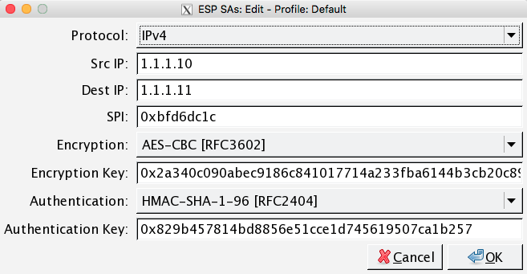
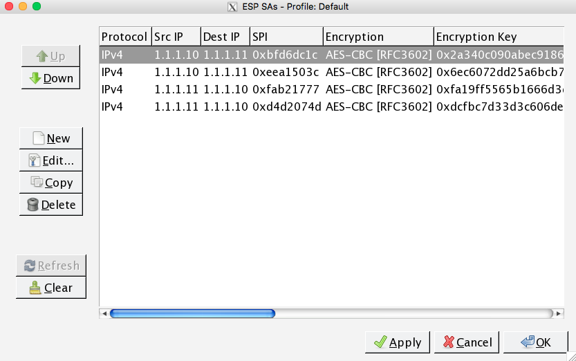

# 概要
pcapファイルの内容を解読してflagを探す問題

## 参考リンク
[IPsec(ISAKMP、ESP)の復号化手順](http://saitoh.hatenablog.jp/entry/2014/09/29/022926)

# Writeup

## 流れ
1. Wiresharkでpcapファイルを表示
2. TELNETの通信の中身を見る
3. `sudo ip xfm state`コマンドの結果を見る(これがESPの復号に必要な情報)
4. Wireshark上でESPの復号化設定を行う(`auth`, `enc`などの情報を入力。`ip xfm state`で表示された4方向すべて必要。)
5. ESPの情報が復号化されるので、後はあやしい通信を探す
6. `GET /img/flag.png`という、いかにもな通信(No.410)がある
7. No.410のHTTPレスポンスにあたるNo.414の中身を見る
8. PNGファイルなので、Wiresharkで画像としてエクスポート
9. 画像にflagの値が書いてあるので、それを見てニヤける

### `sudo ip xfm state`の結果からのWiresharkのESP復号化設定
ここだけわかりにくいので、補足しておきます。

(TELNETの)以下のコマンドの結果を基に、WiresharkでESP復号化設定を行います。


```
[reds@localhost ~]$ sudo ip xfrm state
[sudo] password for reds: ynwa
src 1.1.1.11 dst 1.1.1.10
.proto esp spi 0xfab21777 reqid 16389 mode tunnel
.replay-window 32 flag 20
.auth hmac(sha1) 0x11cf27c5b3357a5fd5d26d253fffd5339a99b4d1
.enc cbc(aes) 0xfa19ff5565b1666d3dd16fcfda62820da44b2b51672a85fed155521bedb243ee
src 1.1.1.10 dst 1.1.1.11
.proto esp spi 0xbfd6dc1c reqid 16389 mode tunnel
.replay-window 32 flag 20
.auth hmac(sha1) 0x829b457814bd8856e51cce1d745619507ca1b257
.enc cbc(aes) 0x2a340c090abec9186c841017714a233fba6144b3cb20c898db4a30f02b0a003d
src 1.1.1.10 dst 1.1.1.11
.proto esp spi 0xeea1503c reqid 16389 mode tunnel
.replay-window 32 flag 20
.auth hmac(sha1) 0x951d2d93498d2e7479c28c1bcc203ace34d7fcde
.enc cbc(aes) 0x6ec6072dd25a6bcb7b9b3b516529acb641a1b356999f791eb971e57cc934a5eb
src 1.1.1.11 dst 1.1.1.10
.proto esp spi 0xd4d2074d reqid 16389 mode tunnel
.replay-window 32 flag 20
.auth hmac(sha1) 0x100a0b23fc006c867455506843cc96ad26026ec0
.enc cbc(aes) 0xdcfbc7d33d3c606de488c6efac4624ed50b550c88be0d62befb049992972cca6
```

Edit > Preferences > Protocols > ESP > Edit > New より、上記の結果を追加(項目はお察し…)




